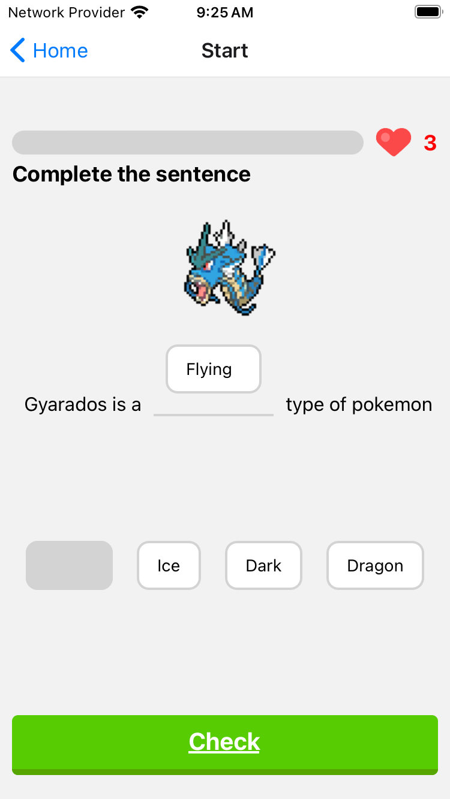
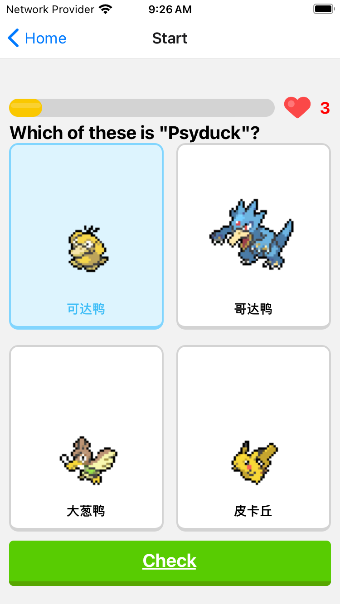
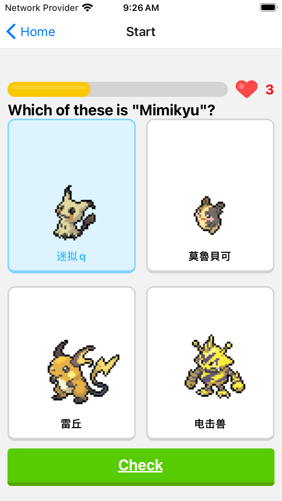
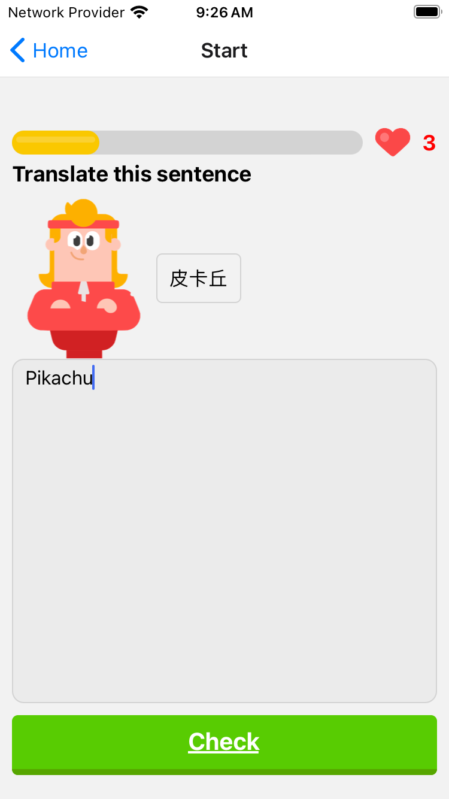
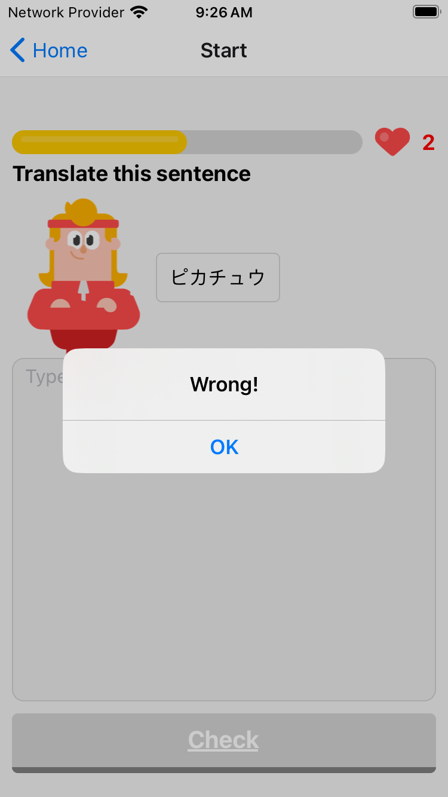
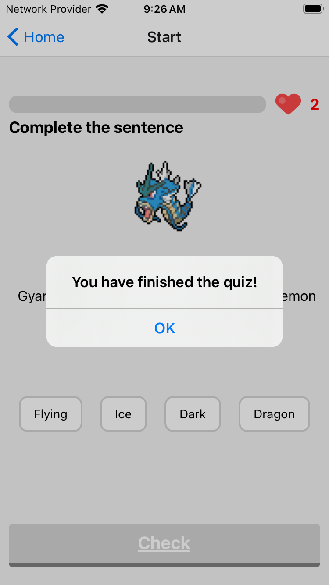
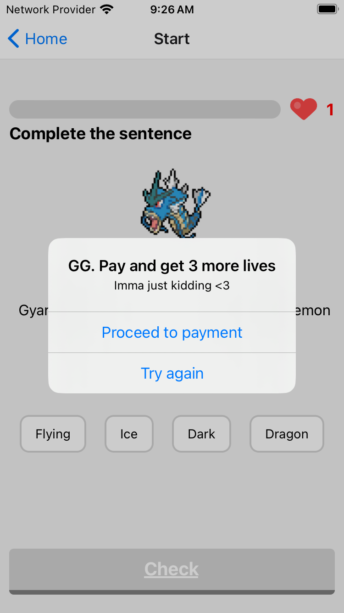

This repo is a duolingo clone test for cc to learn about react native all components and basic logic.
The test proj was following accordingly to @Vadim Savin which the tutorial could be found from https://www.youtube.com/@notjustdev

The following notes includes the ss for all the interfaces and logic behind.

1. Fill blank question.

2. Multiple choice question.

The idea behind is have a data list which specify the correct ans and when the correct ans clicked pass the correct param. 

4. Open ended question.

5. When clicked and submit wrong ans

Whenever the question didnt been ans correctly, the lives-1 and pop an dialog box with txt.

6. When quiz done

Currently it will direct to the specifc page(1st pg) when done, would suggest to have a leaderboard/result conclude at the end.

7. When no more lives

Same as quiz done, bring to 1st page but reset the lives and ask user if want to restart.

*The code includes statesave which save the current state(stages and lives)
*The code includes a simple progressbar on top following the stage progress

Summary:
The basic was done and this pokelingo clone test is expected to be improved by adding following details:
1 Sound efx (correct, wrong, bgm and etc).
2 Homepage allow user to do specific settings and show instructions.
3 Result page/leaderboard which save user correct rate.

Although still lots of things wanna try but cc decide to escape from this and learn Jenkins first, brb once Jenkins tutorial done.
